# Lecture 1: Introduction to Deep Learning

**Date:** 2025-12-15
**Video:** [Link](https://www.youtube.com/watch?v=alfdI7S6wCY&list=PLtBw6njQRU-rwp5__7C0oIVt26ZgjG9NI&index=1)
**Slides:** [Link](https://introtodeeplearning.com/2025/slides/6S191_MIT_DeepLearning_L1.pdf)
**Instructor:** Alexander Amini

---

## 📌 Executive Summary
This lecture provides a foundational introduction to Deep Learning. It traces the evolution from biological neurons to the Perceptron and Multi-Layer Perceptrons (Deep Neural Networks). Key topics incude the mechanics of training neural networks using Loss Functions, Backpropagation, and Gradient Descent, as well as strategies to improve performance and generalization, such as Activation Functions, Optimizers, and Regularization techniques like Dropout and Early Stopping.
---

## 🧠 Core Concepts & Terminology

- **Artificial Intelligence (AI)**: Any technique that enables computers to mimic human behavior.
- **Machine Learning (ML)**: A subset of AI that enables computers to learn from data without being explicitly programmed.
- **Deep Learning (DL)**: A subset of ML that extracts patterns from data using neural networks.
- **Perceptron**: The fundamental building block of neural networks, acting as a single neuron.
- **Dense Layer**: A fully connected layer where every input node is connected to every output node.
- **Forward Propagation**: The process of passing input data through the network's layers to generate an output.
- **Activation Function**: A non-linear function applied to the output of a neuron, enabling the network to learn complex, non-linear patterns (e.g., Sigmoid, Tanh, ReLU).
- **Loss Function**: A metric that quantifies the difference between the model's prediction and the actual ground truth (e.g., MSE, Cross-Entropy).
- **Gradient Descent**: An optimization algorithm used to minimize the loss function by iteratively adjusting weights.
- **Backpropagation**: An algorithm that calculates the gradient of the loss function with respect to each weight by applying the chain rule from the output layer backwards.
- **Learning Rate**: A hyperparameter that controls the step size taken during gradient descent updates.
- **Overfitting**: A modeling error which occurs when a function is too closely fit to a limited set of data points, performing well on training data but poorly on unseen data.
- **Regularization**: Techniques used to prevent overfitting by penalizing complex models (e.g., Dropout, Early Stopping).
- **Stochastic Gradient Descent (SGD)**: A variant of gradient descent that updates weights using a single data point or a small batch, rather than the entire dataset.

---

## 📝 Detailed Notes

### 1. Why deep learning? and why now ?
- Traditional machine learning methods relied on hand-engineered features which were time consuming, brittle, and not scalable
- Deep learning methods learn features automatically from data
- Deep Learning has been around for a long time so why has it only become popular now?
    a. Data: Availability of large amount of data from creation of the internet
    b. Computation: Availability of compute through GPU and TPUs advancements
    c. Software: Availability of open source toolbox like tensorflow, pytorch and jax which enable quicker adoption. 

### 2. The Perceptron: A simple neuron

Forward Propagation:
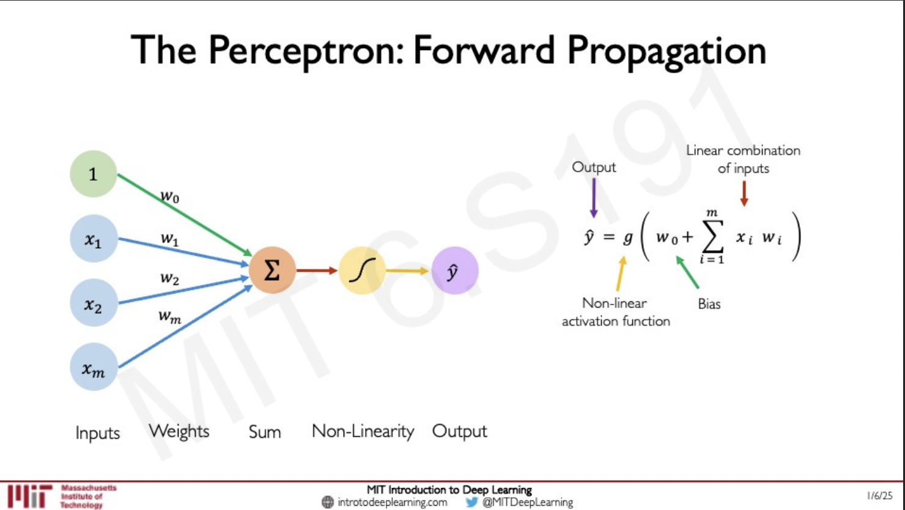
- A set of inputs (x1, x2, x3, x4,.. xm) and a set of weights (w1, w2, w3, w4,.. wm) are multiplied and then passed through a non linear activation function to create the ouput.
- A bias term (b) is added to the input to shift the activation function.
-  we can rewrite the equation using vectors and dot products

$$ \hat{y} = g(w_0 + \sum_{i=1}^{m} w_i x_i) $$
$$ \hat{y} = g(w_0 + \mathbf{X}^T \mathbf{W}) $$
where $ \mathbf{X} = [x_1, \dots, x_m] $ and $ \mathbf{W} = [w_1, \dots, w_m] $


Non Linear Activation Functions:


This image shows common activation functions used in deep learning and its derivatives.
- Sigmoid: $ g(x) = \frac{1}{1 + e^{-x}} $ 
- Tanh: $ g(x) = \frac{e^x - e^{-x}}{e^x + e^{-x}} $ 
- ReLU: $ g(x) = max(0, x) $ 

Pytorch and Tensorflow code snippets:

Sigmoid: 
```python
torch.sigmoid(x) 
tf.sigmoid(x)
```

Tanh: 
```python
torch.tanh(x)
tf.tanh(x)
```

ReLU: 
```python
torch.relu(x)
tf.nn.relu(x)
```

### 3. Multi Output Perceptron
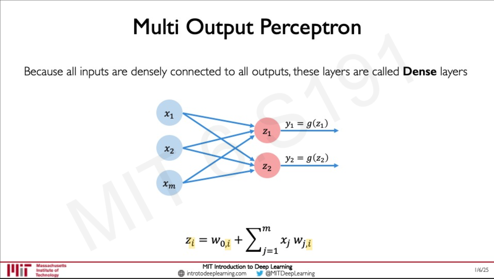

- To get a multioutput perceptron, we just add another perceptron creating 2 neurons.
- They have the same inputs but because their weights are different, they will output different values.
- These type of layers are called dense layers, because they are dense in the sense that every input is connected to every output.
- If you exclude the non linear activation function, then the multioutput perceptron is a linear layer.

#### Dense Layer from scratch in PyTorch and TensorFlow:

Pytorch:
```python
class MyDenseLayer(torch.nn.Module):
    def __init__(self, input_dims, output_dims):
        super(MyDenseLayer, self).__init__()
       
       # Initialize weights and biases
       self.w = torch.nn.Parameter(torch.randn(input_dims, output_dims, requires_grad=True))
       self.b = torch.nn.Parameter(torch.randn(1, output_dims, requires_grad=True))
    def forward(self, inputs):
        # dot product of inputs and weights
        z = torch.matmul(inputs, self.w) + self.b
        # Apply non linear activation function (can be ReLU, Sigmoid, Tanh, etc)
        output = torch.relu(z)
        return output
```


Built in dense layer:

```python
nn.Linear(in_features, out_features)
```

Tensorflow:
```python
class MyDenseLayer(tf.keras.layers.Layer):
    def __init__(self, input_dims, output_dims):
        super(MyDenseLayer, self).__init__()
       
       # Initialize weights and biases
       self.w = self.add_weight(shape=(input_dims, output_dims), initializer='random_normal')
       self.b = self.add_weight(shape=(output_dims,), initializer='random_normal')

        def call(self, inputs):
        # dot product of inputs and weights
            z =  tf.matmul(inputs, self.w) + self.b
            # Apply non linear activation function (can be ReLU, Sigmoid, Tanh, etc)
            output = tf.nn.relu(z)
            return output
```


Built in dense layer:

```python
tf.keras.layers.Dense(units, activation)
```


### 4. Single Layer Neural Network
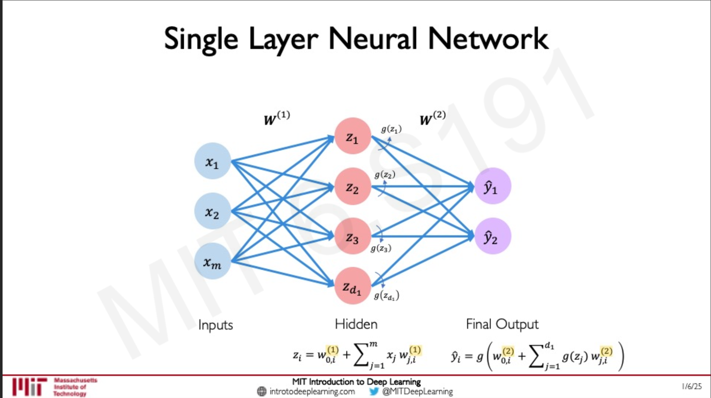
- A single hidden layer is placed between the input and output layer.
- The hidden layer is a dense layer.
- Its called hidden because the we don't directly observe the data in the hidden layer.

Pytorch:

```python
model = nn.Sequential(
    nn.Linear(input_size, hidden_size),
    nn.ReLU(),
    nn.Linear(hidden_size, output_size)
)
```

Tensorflow:
```python
model = tf.keras.Sequential([
    tf.keras.layers.Dense(hidden_size, activation='relu'),
    tf.keras.layers.Dense(output_size)
])
```

### 5. Deep Neural Network
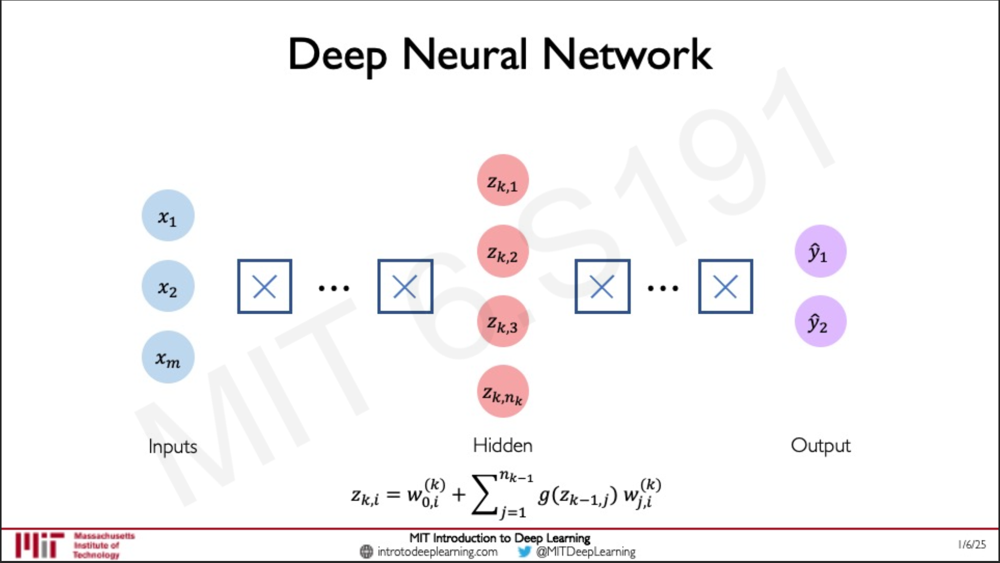

- A deep neural network is just sequentially stacking linear layers with non linear activation functions in a hierarchical manner.

Pytorch:
```python
model = nn.Sequential(
    nn.Linear(input_size, hidden_size),
    nn.ReLU(),
    nn.Linear(hidden_size, hidden_size),
    nn.ReLU(),
    nn.Linear(hidden_size, output_size)
)
```

Tensorflow:
```python
model = tf.keras.Sequential([
    tf.keras.layers.Dense(hidden_size, activation='relu'),
    tf.keras.layers.Dense(hidden_size, activation='relu'),
    tf.keras.layers.Dense(output_size)
])
```

### Loss
- In order to train a neural network, it has to understand when it makes bad predictions. It needs to quantify how bad/good a prediction is to learn from it, this is called the loss

- The loss of the network measures the cost incurred from incorrect predictions.
- It is a measure of how far its predictions are from the ground truth observations.
- Smaller the loss, closer the prediction


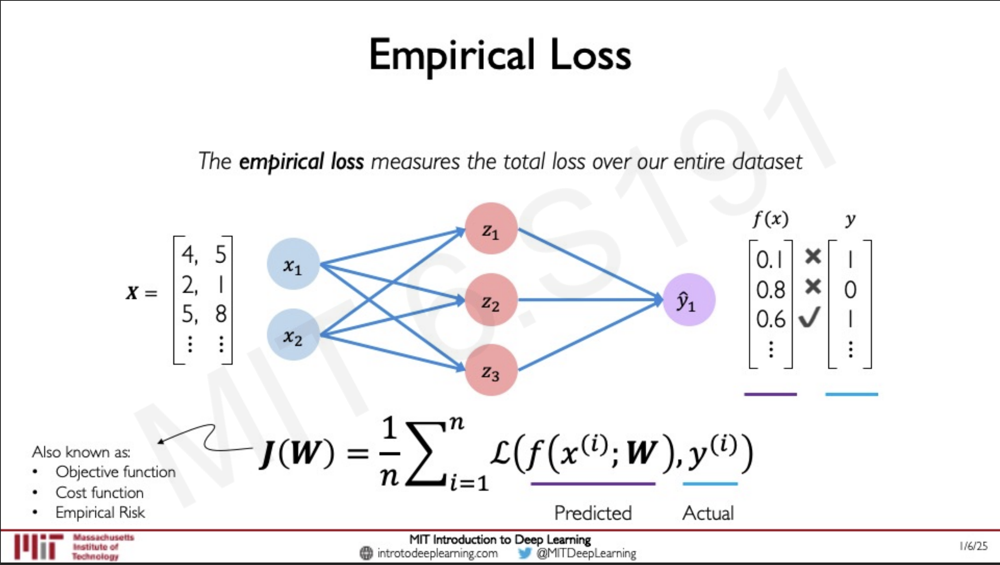
- Empirical Loss measures the total loss over the entire dataset.
- Simply the avg loss for every data point in the data set. 

Binary Cross Entropy Loss
- Used with models that output a probability between 0 and 1
- Also called softmax cross entropy loss
- measures the difference between 2 binary probability distributions

## Latex for the loss
$$ L = - \frac{1}{N} \sum_{i=1}^{N} [y_i \log(\hat{y}_i) + (1 - y_i) \log(1 - \hat{y}_i)] $$


Pytorch
```python
torch.nn.functional.cross_entropy(predicted, y)
```

TensorFlow

```python
tf.reduce_mean(tf.nn.softmax_cross_entropy_with_logits(y, predicted))
```

Mean Squared Error Loss
- Used when outputs are continous real numbers
- Measures the average squared difference between the predicted and actual values.


## Latex for the loss
$$ L = \frac{1}{2N} \sum_{i=1}^{N} (y_i - \hat{y}_i)^2 $$

Pytorch
```python
loss = torch.nn.MSELoss(predicted, y)
```

TensorFlow
```python
loss = tf.keras.losses.MeanSquaredError(predicted, y)
```
- Many more type of losses

### Training a neural 
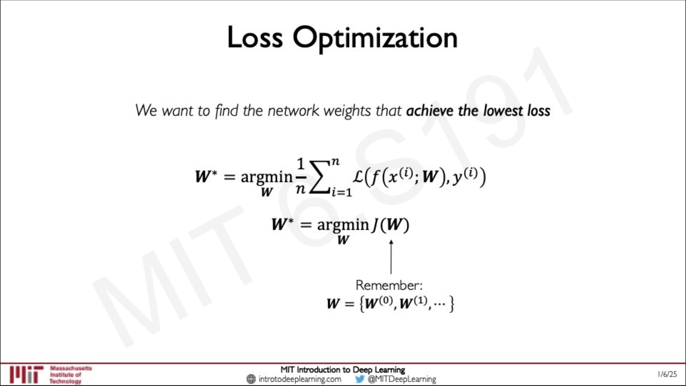
- Finding the weights the trained network 
- Goal is to find the weights that minimize the loss on the dataset

$$ W^* = \underset{W}{\mathrm{argmin}} \frac{1}{n} \sum_{i=1}^{n} \mathcal{L}(f(x^{(i)}; W), y^{(i)}) $$

$$ W^* = \underset{W}{\mathrm{argmin}} J(W) $$

$$ W = \{W^{(0)}, W^{(1)}, \dots\} $$


How do we optimize the weights ?
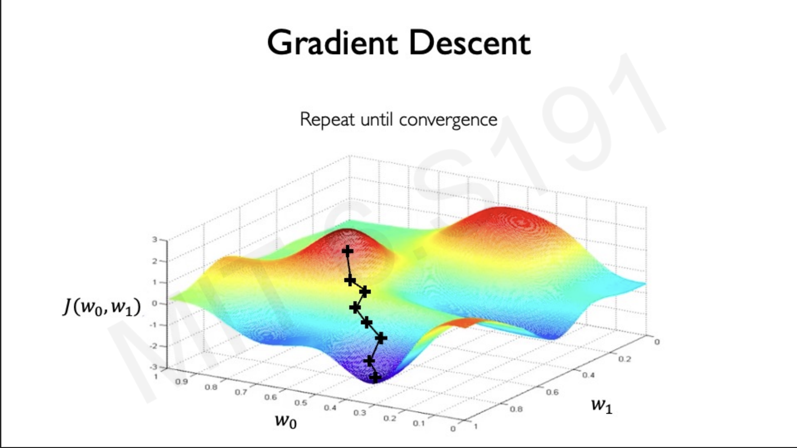
- Remember the loss is a function of the network weights
- If we had just two weights, we can plot the loss landscape
- What we want to do is find the minimum of this loss landscape

How do we do it ?
1. Start at a random point in the loss landscape
2. Compute gradient, this tells us which way is up so,
3. We take a small step in the opp direction. 
4. Repeat, untill we reach the min

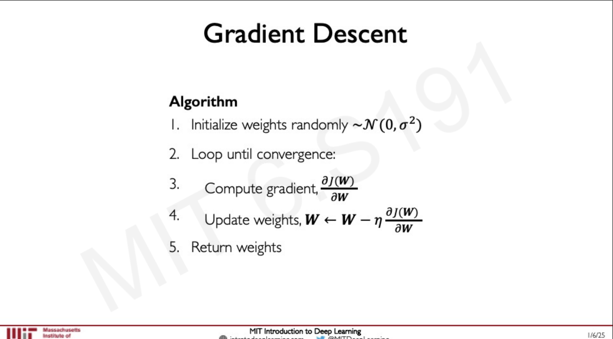

PyTorch:
```python
# Stochastic Gradient Descent Loop
optimizer = torch.optim.SGD(model.parameters(), lr=0.01)

for epoch in range(epochs):
    # 1. Forward pass
    y_pred = model(x_train)
    # 2. Compute loss
    loss = criterion(y_pred, y_train)
    # 3. Backward pass (compute gradients)
    loss.backward()
    # 4. Update weights
    optimizer.step()
    # 5. Reset gradients
    optimizer.zero_grad()
```

TensorFlow:
```python
# Stochastic Gradient Descent Loop
optimizer = tf.keras.optimizers.SGD(learning_rate=0.01)

for epoch in range(epochs):
    with tf.GradientTape() as tape:
        # 1. Forward pass
        y_pred = model(x_train)
        # 2. Compute loss
        loss = compute_loss(y_train, y_pred)
    # 3. Compute gradients
    grads = tape.gradient(loss, model.trainable_variables)
    # 4. Update weights
    optimizer.apply_gradients(zip(grads, model.trainable_variables))
```

### Computing Gradients: Backpropagation


- How do we compute the gradient of the loss with respect to the weights?
- We apply the **Chain Rule** of calculus.
- Start from the loss and propagate the gradients backward through the network.

$$ \frac{\partial J(W)}{\partial w_1} = \frac{\partial J(W)}{\partial \hat{y}} * \frac{\partial \hat{y}}{\partial z_1} * \frac{\partial z_1}{\partial w_1} $$

- Repeat this for **every weight in the network** using gradients from later layers.


Neural networks in practice

- Optimizing NN can be difficult to optimize

- Learning Rate decides how big of a step we take in the opposite direction of the gradient

- In practice, setting the constant learning rate is not a good idea because if we set it very small it takes a long time to train and if we set it very large it may not converge.

- Adaptive learning rates are used in practice to adjust the learning rate during training.

### Optimizers 
- SGD
- Adam
- RMSProp
- Adagrad
- Adadelta

| Optimizer | PyTorch | TensorFlow |
| :--- | :--- | :--- |
| **SGD** | `torch.optim.SGD(model.parameters(), lr=0.1)` | `tf.keras.optimizers.SGD(learning_rate=0.1)` |
| **Adam** | `torch.optim.Adam(model.parameters(), lr=0.001)` | `tf.keras.optimizers.Adam(learning_rate=0.001)` |
| **RMSprop** | `torch.optim.RMSprop(model.parameters(), lr=0.01)` | `tf.keras.optimizers.RMSprop(learning_rate=0.01)` |
| **Adagrad** | `torch.optim.Adagrad(model.parameters(), lr=0.01)` | `tf.keras.optimizers.Adagrad(learning_rate=0.01)` |
| **Adadelta** | `torch.optim.Adadelta(model.parameters())` | `tf.keras.optimizers.Adadelta()` |

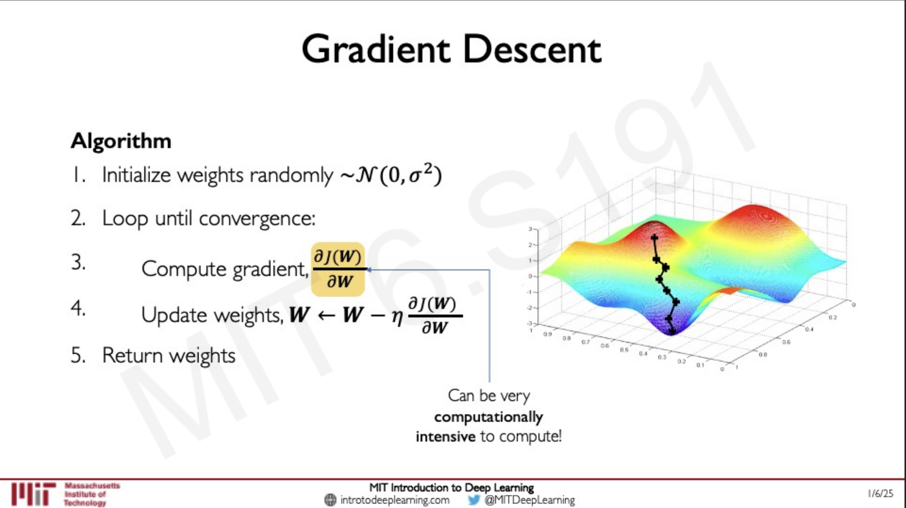
- Gradient Descent step is computationally very expensive to compute. 
- It is computed as an average over all the data points in the dataset.
- In practice, it is not feasible to compute the gradient over the entire dataset, if the dataset is too large.


Solution: Stochastic Gradient Descent (SGD)
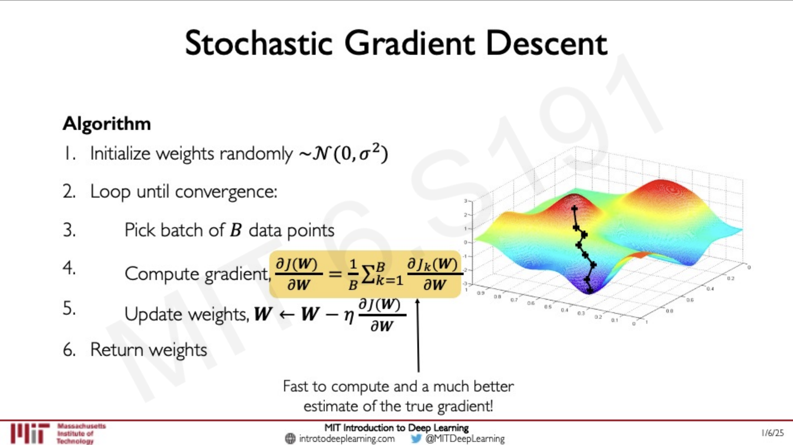
- Instead of computing the gradient over the entire dataset, we compute it over a small subset of the dataset.
- This is called a mini **batch** gradient descent.
- This makes the convergence smoother which also allows for larger learning rates.
- Also allows for parallelization of the gradient computation using GPUs


Overfitting:
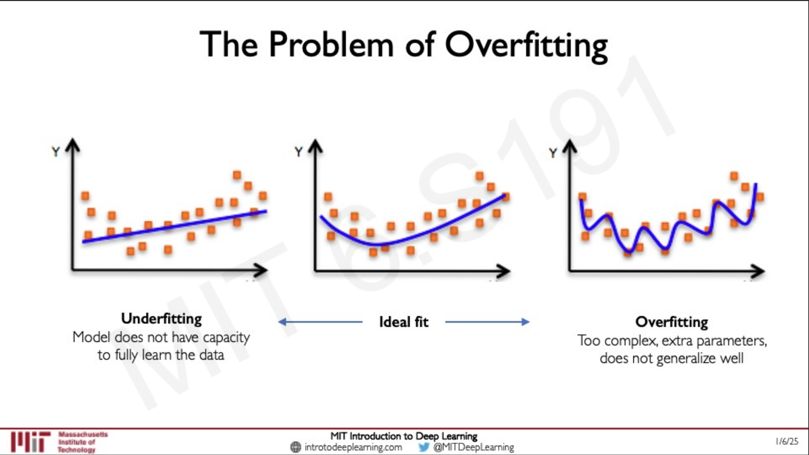
- In ML, we want to build models that don't just work well on the training data but also generalise well to new data.
- Overfitting is when a model performs well on the training data but poorly on new data.

Regularization:
- Technique that constraints our optimization problem to discourage complex models.
- This improves generalization of the model on unseen data.

Regularization Techniques:
- Dropout: 
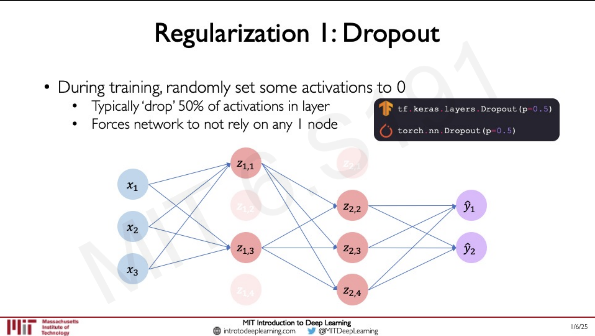
During training, we randomly drop out some of the neurons, meaning set some activations to 0.
    - Typically drop 50% of the activations layers.
Lowers the capacity of the model. It forces the model to learn more general features.

- Early Stopping: 

Stop the training before the model have a chance to overfit.
-  As you start training, the training loss and testing loss decreases but then there comes a point where the testing loss starts to increase while the training loss continues to decrease. This means the model is overfitting.

---

## 📚 References & Resources
- [MIT 6.S191 Website](http://introtodeeplearning.com/)

