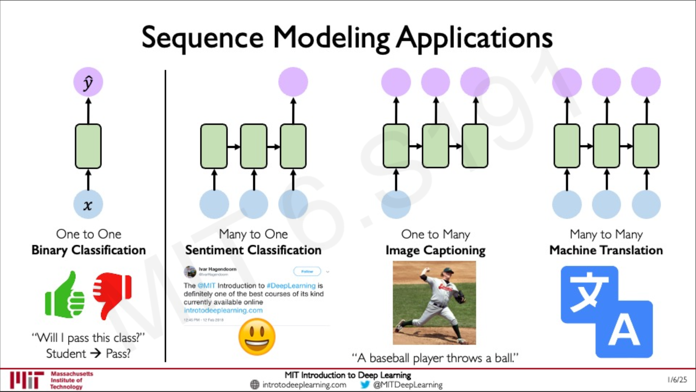
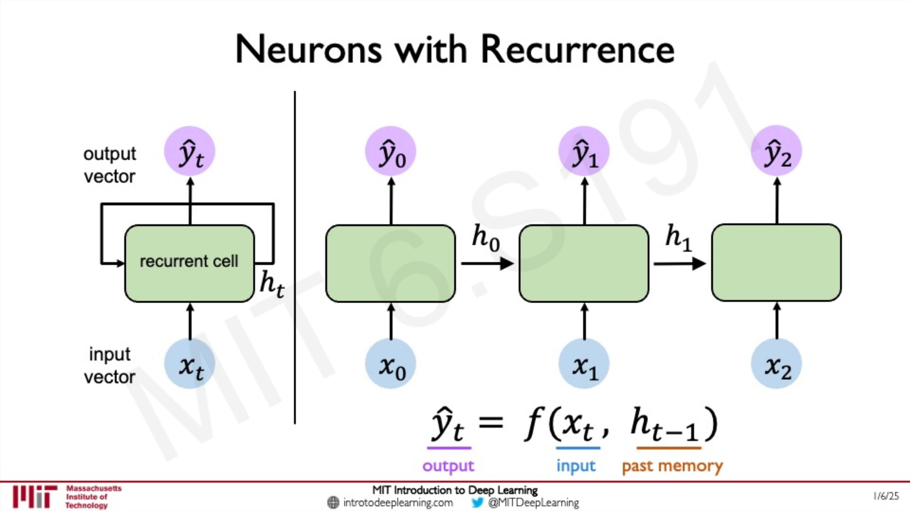
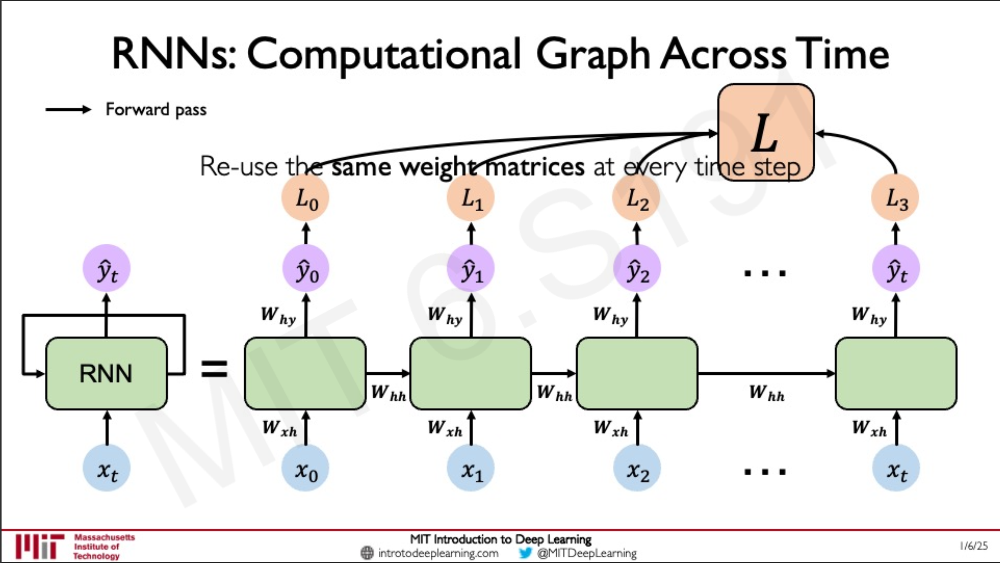
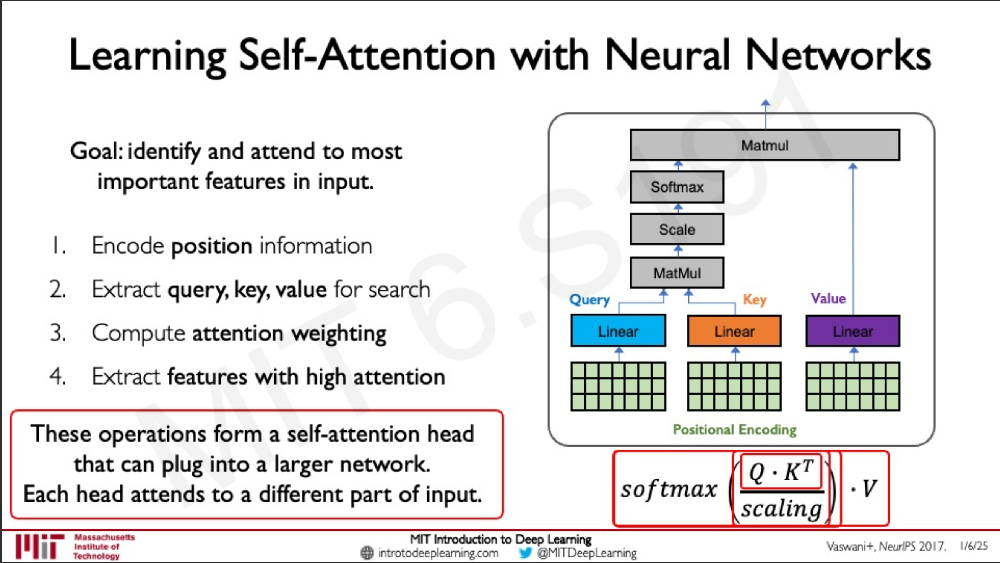
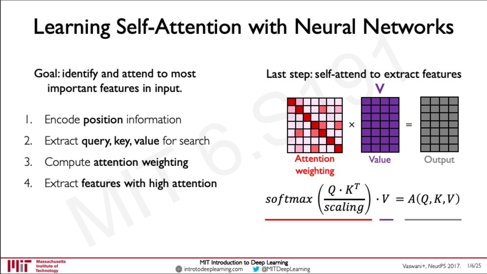

# Lecture 2 — Deep Sequence Modeling

**Course:** MIT 6.S191 (2025)  
**Date:** December 15, 2025  
**Instructor:** Ava Amini
**Video:**  
[Link](https://www.youtube.com/watch?v=GvezxUdLrEk&list=PLtBw6njQRU-rwp5__7C0oIVt26ZgjG9NI&index=3)  
**Slides:**  
[Link](https://introtodeeplearning.com/2025/slides/6S191_MIT_DeepLearning_L2.pdf)

---

## 📌 Executive Summary

This lecture introduces **sequence modeling**, motivating why standard feed-forward networks are a poor fit for time-dependent data. It covers **recurrent neural networks (RNNs)** and how they are trained with **backpropagation through time (BPTT)**, then transitions to the motivation for **attention** and the **Transformer** family of models.

---

## 🧠 Core Concepts & Terminology

- **Sequence:** An ordered set of inputs/outputs (e.g., words in a sentence, audio frames, sensor readings).
- **Sequence modeling:** Learning functions that map sequences to outputs (single output or another sequence).
- **One-to-one / many-to-one / many-to-many:** Common input/output patterns for sequence tasks.
- **RNN (Recurrent Neural Network):** A neural network that maintains a **hidden state** updated over time.
- **Hidden state ($h_t$):** The model’s internal “memory” summarizing past inputs up to time $t$.
- **Unrolling:** Viewing an RNN as the same cell repeated across time steps.
- **BPTT (Backpropagation Through Time):** Backpropagation applied over the unrolled computation graph.
- **Vanishing/exploding gradients:** Instabilities that make long-range dependencies hard to learn in standard RNNs.
- **LSTM / GRU:** Gated RNN variants designed to help with long-term dependencies.
- **Vectorization / tokenization:** Converting raw inputs (e.g., words) into numeric representations.
- **One-hot encoding:** Sparse vectors of length $V$ (vocabulary size) with a single 1.
- **Embedding:** Dense learned vectors of dimension $d \ll V$ that capture semantic similarity.
- **Self-attention:** Computes weighted combinations of tokens based on relevance to each token.
- **Queries/Keys/Values (Q/K/V):** Learned projections used to compute attention weights and outputs.
- **Positional encoding:** Injects position/order information when processing sequences in parallel.

---

## 📝 Detailed Notes

### 1) What counts as a “sequence”?

Examples of sequences “in the wild”:
- Audio (waveforms / frames)
- Text (NLP)
- Video (frames)
- ECGs and other biomedical signals
- DNA
- Weather time series
- Stock prices

Sequence models can map:
- A single input → a single output (one-to-one)
- A sequence → a single output (many-to-one)
- A sequence → a sequence (many-to-many)

**Common patterns**

| Input → Output | Example |
|---|---|
| One-to-one | Binary classification on a fixed feature vector |
| Many-to-one | Sentiment classification from a sentence |
| Many-to-many | Machine translation (sentence → sentence) |

---

### 2) Why not just use a feed-forward network?

A standard feed-forward network has **no built-in notion of time**. If we feed each time step independently (e.g., each word separately), predictions at time $t$ do not naturally depend on the **history** $(x_1, \dots, x_{t-1})$—which is exactly what we want in sequential data.

We need a way for the model’s internal computation at time $t$ to incorporate information from earlier time steps.

---

### 3) Recurrent Neural Networks (RNNs)

RNNs introduce a **recurrence** by carrying a hidden state forward through time:

$$\hat{y}_t = f(x_t, h_{t-1})$$

Intuition:
- **Input:** current observation $x_t$
- **Memory:** past information summarized in $h_{t-1}$
- **Output:** prediction $\hat{y}_t$

A common parameterization:

$$h_t = \phi(W_x x_t + W_h h_{t-1} + b_h)$$
$$\hat{y}_t = \psi(W_y h_t + b_y)$$

where:
- $\phi$ is typically a nonlinearity like `tanh` or `ReLU`
- $\psi$ depends on the task (e.g., identity for regression, softmax for classification)

**Key idea:** the same weights are reused at every time step, and the hidden state connects the computation across time.

---

### 4) Training RNNs: loss across time + BPTT

For supervised sequence problems, we often compute a loss at each time step and sum over the sequence:

$$\mathcal{L} = \sum_{t=1}^{T} \mathcal{L}_t\big(y_t, \hat{y}_t\big)$$

Training requires gradients that flow through the unrolled RNN across time steps:
- Forward pass: compute $(h_t, \hat{y}_t)$ for $t = 1 \dots T$
- Backward pass: propagate gradients backward through all time steps (**BPTT**)

**Practical challenge:** standard RNNs can be hard to train because gradients can:
- **Vanish** (go to ~0), making long-term dependencies hard to learn
- **Explode** (grow very large), causing instability

Common mitigations:
- Gradient clipping (helps exploding gradients)
- Truncated BPTT (limits how far back gradients flow)
- Using gated architectures: **LSTM** or **GRU**

---

### 5) Case study: next-word prediction (language modeling)

Goal: given previous words $(w_1, \dots, w_t)$, predict the next word $w_{t+1}$.

#### Step 1 — Vectorize words
Models operate on numbers, so we represent each token `as a vector.

**Option A: One-hot encoding**
- Build a vocabulary of size $V$
- Map each word to an index $i \in \{1, \dots, V\}$
- Represent each word as a vector $e_i \in \mathbb{R}^V$ with a single 1 and zeros elsewhere

Downside: vectors are high-dimensional and do not encode similarity (all distinct tokens are equally “far apart” in one-hot space).

**Option B: Learned embeddings**
- Learn an embedding matrix $E \in \mathbb{R}^{V \times d}$
- Convert token index $i$ to an embedding vector $E[i] \in \mathbb{R}^d$

Benefit: embedding geometry can capture semantics (words used in similar contexts tend to be close under cosine similarity).

#### Step 2 — Predict distribution over the vocabulary
For a language model, we often produce logits and apply a softmax:

$$p(w_{t+1} \mid w_{\le t}) = \mathrm{softmax}(W h_t + b)$$

**Computational note:** when $V$ is large, full softmax can be expensive. Techniques like **negative sampling** (e.g., Word2Vec/Skip-gram) or sampled/approximate softmax variants are common in large-vocabulary settings.

---

### 6) Limitations of (standard) RNNs

- **Encoding bottleneck:** $h_t$ is a fixed-length vector, limiting how much information can be carried forward.
- **Slow / limited parallelism:** computation is sequential in time (depends on $h_{t-1}$), so it’s hard to parallelize across time steps.
- **Long-term dependencies:** vanishing/exploding gradients make long-range memory difficult in practice.

Desired capabilities:
- Stream processing (handle sequences continuously)
- Strong parallelism
- Better long-range memory

These motivate **attention-based** models.

---

### 7) Self-attention (intuition → math)

Instead of compressing all past information into a single hidden state, attention lets the model **selectively focus** on the most relevant parts of the input.

**Search analogy**
- **Query (Q):** what I’m looking for
- **Keys (K):** candidates to match against
- **Values (V):** information to retrieve from matched candidates

#### Scaled dot-product self-attention
Given token representations $X$, we compute:

$$Q = XW_Q,\quad K = XW_K,\quad V = XW_V$$

Attention weights:

$$A = \mathrm{softmax}\left(\frac{QK^\top}{\sqrt{d_k}}\right)$$

Output:

$$\mathrm{Attention}(Q,K,V) = AV$$

This is powerful because (unlike RNNs) we can compute attention for all tokens in **parallel**.

#### Positional information
If we feed the whole sequence at once, we still need order information. This is handled using **positional encodings/embeddings** added to token embeddings.

---

## ❓ Questions & Further Research

- [ ] Positional encodings: sinusoidal vs learned positional embeddings
- [ ] When to use LSTM/GRU vs Transformer-style models
- [ ] Multi-head attention: why it helps and how it’s implemented

